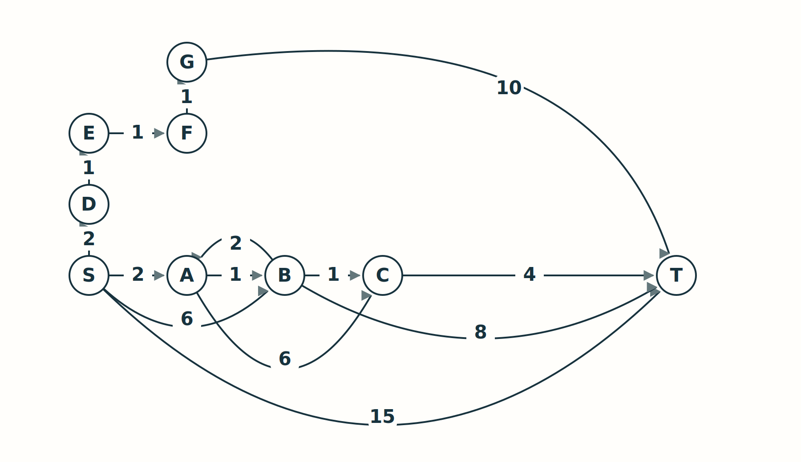

# Dijkstra and A*: worksheet

**Name:** ____________________________    **Partner:** ____________________________

## 1. Which routes must we keep?  |  09-28 min

Directed edges carry additive costs. Start at S and finish at T. Use the same graph throughout this page. Do not assume a discovered distance is final.



**Predict:** What does first discovery of T return? Find a cheaper candidate route.

First discovered cost: __________    Cheaper route and cost: ___________________________

**Trace the first six non-stale extractions.** Write only labels that improve. Tie-breaking: neighbor order from the fixture; FIFO for equal priorities. The first two non-stale extractions are S, then A.

| Selected node and g | Improved labels and their predecessors |
|---|---|
| S, 0 | |
| A, 2 | |
| | |
| | |
| | |
| | |

**Justify:** Why can the minimum-g frontier node be finalized? Where is nonnegativity used?

________________________________________________________________________________

________________________________________________________________________________

<!-- PAGEBREAK -->
# Counterexample laboratory

## 2. Is admissibility enough to close a state forever?  |  61-68 min

Use this separate four-node graph; all edges are directed. The heuristic values are assigned estimates, not drawing distances.

```text
S -> A : 3       S -> B : 1       B -> A : 1       A -> T : 3
h(S) = 0        h(A) = 0         h(B) = 4         h(T) = 0
```

Confirm that every h value is admissible. Then trace A* using f=g+h.

| Selected state | g | h | f | What changes? |
|---|---|---|---|---|
| S | | | | |
| | | | | |
| | | | | |
| | | | | |
| | | | | |

Returned cost without reopening: __________    With reopening: __________

Which edge violates consistency? Write the failed inequality.

________________________________________________________________________________

Repair the implementation, or strengthen the assumptions. State both options.

________________________________________________________________________________

## 3. Change the movement rules  |  77-86 min

On a four-neighbor unit grid, removing walls motivates Manhattan distance. Now allow a diagonal move for cost 1. Give a start/goal pair that refutes Manhattan admissibility.

________________________________________________________________________________

What lower bound would fit the new movement model?

________________________________________________________________________________

## Exit ticket  |  86-90 min

**A.** Why is discovering the goal different from certifying its cost?

________________________________________________________________________________

**B.** Why is skipping a stale entry different from refusing to reopen a state?

________________________________________________________________________________

**C.** Does a smaller number of expansions prove a smaller runtime? Explain one missing factor.

________________________________________________________________________________
